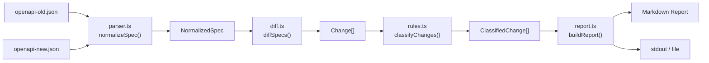
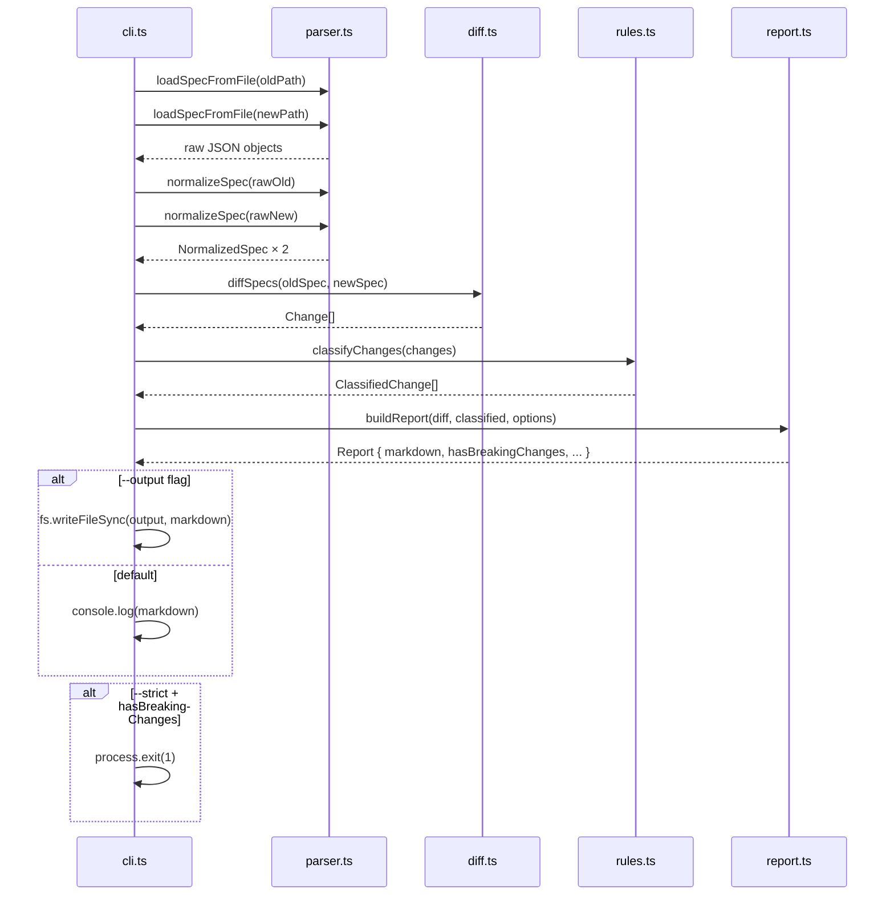
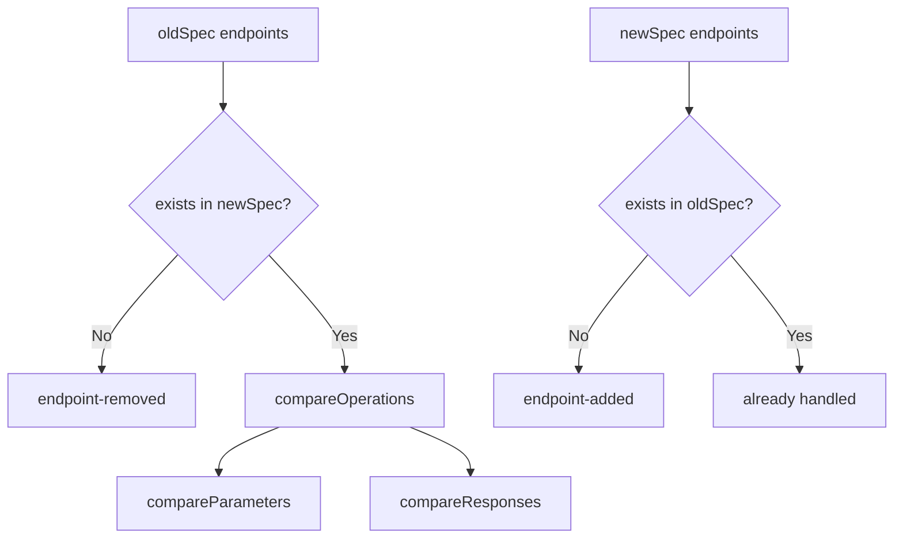

# Architecture — contract-guard v1.0.0

## System Overview

`contract-guard` es una CLI stateless que lee dos archivos JSON (especificación OpenAPI 3.x antigua y nueva), los normaliza a un AST interno, compara los ASTs con un motor de reglas declarativo, y emite un reporte Markdown clasificado por severidad.

### Data Flow



### Pipeline Sequence



## Source Modules

### `src/parser.ts`

Lee y normaliza specs OpenAPI 3.x. Produce un AST tipado independientes del formato original.

**Responsabilidad:** Leer y validar specs OpenAPI 3.x, normalizar a estructuras tipadas.

**Entrada:** JSON arbitrario (fs.readFileSync).

**Salida:** `NormalizedSpec` con un array de `NormalizedOperation`.

**Estructuras NormalizedSpec:**
- `title` / `version` / `openapiVersion` extraídos de `info` y `openapi`
- `endpoints[]` — una entrada por cada `(method, path)` en `paths`
- Cada `NormalizedOperation` contiene: method, path, parameters, responses, requestBody

**Notas de implementación:**
- Soporta solo OpenAPI 3.x (`openapi` empieza con `3.`) — validado por `isOpenApi3Object()`
- `$ref` en parámetros se procesa como parámetro vacío (MVP — resolución completa en V2)
- `normalizeSchema` es recursiva para `properties` y `items`

### `src/diff.ts`

Compara dos `NormalizedSpec` y enumera todos los cambios entre ellos.

**Estrategia:**


**Cambios detectados:**

| Kind | Severity | Notes |
|------|----------|-------|
| `endpoint-removed` | BREAKING | Operación eliminada |
| `parameter-removed` | BREAKING | Parámetro eliminado |
| `parameter-required-added` | BREAKING | Nuevo parámetro obligatorio |
| `parameter-type-changed` | BREAKING | Cambio de tipo en parámetro |
| `response-removed` | BREAKING | Código de respuesta eliminado |
| `parameter-optional-added` | WARNING | Nuevo parámetro opcional |
| `endpoint-added` | SAFE | Nueva operación agregada |
| `response-added` | WARNING | Nuevo código de respuesta |

### `src/rules.ts`

Clasifica cambios por severidad e impone reglas configurables.

**Archivo:**
- `Severity` enum: `BREAKING | WARNING | SAFE`
- `classifyChanges(changes[])` — mapea cada `ChangeKind` a `Severity`
- `countBySeverity(changes[])` — cuenta cambios por bucket
- `applyRules(changes[], options)` — stub para reglas configurables (ej. `optionalParametersAreSafe`)
- `RuleOptions` — interfaz para configuración de reglas (extensible en V2)

**Extensibilidad:** Añadir nuevas reglas = agregar el `ChangeKind` al Set correspondiente (BREAKING/WARNING/SAFE).

### `src/report.ts`

Genera el reporte estructurado y su representación.

**`buildReport(diff, classified, options)` → `Report`:**
```ts
interface Report {
  markdown: string;       // Cuerpo del reporte en Markdown
  hasBreakingChanges: boolean;
  hasWarnings: boolean;
  summary: string;        // "N breaking, N warning(s), N safe"
}
```

**Orden de secciones en el Markdown:** BREAKING CHANGES → WARNINGS → SAFE CHANGES (vacías se omiten).

**`--no-safe` flag:** filtra la sección SAFE CHANGES del output.

### `src/cli.ts`

Interfaz de usuario mediante Commander CLI.

**Comandos:**
```
contract-guard compare <old> <new> [-o report.md] [--strict] [--no-safe]
```

**Exit codes:**
- `0` — ejecución exitosa (incluso con breaking changes, salvo `--strict`)
- `1` — ejecución exitosa + `--strict` + se detectaron breaking changes
- `2` — error (spec no válida, archivo no encontrado, parse error)

**Flujo:**
1. `loadSpecFromFile(oldPath)` + `loadSpecFromFile(newPath)`
2. `normalizeSpec()` × 2
3. `diffSpecs()` → `Change[]`
4. `classifyChanges()` → `ClassifiedChange[]`
5. `buildReport()` → `Report`
6. stdout o archivo según `-o`
7. `process.exit(1)` si `--strict` && `hasBreakingChanges`

## Testing

- **Vitest** como test runner.
- 11 tests cubriendo las 6 reglas obligatorias del MVP + report + parser.
- **Fixtures reales** en `fixtures/old-api.json` y `fixtures/new-api.json`.

## Roadmap V2

- GraphQL SDL y gRPC/protobuf
- Reglas configurables por organización (archivo `contract-guard.config.ts`)
- Resolución completa de `$ref` en specs
- Comentarios automáticos en PR (GitHub API)
- SARIF output para integraciones de security scanning