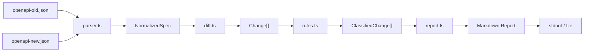

# Technical Design — contract-guard v1.0.0

> This document describes the internal design of `contract-guard` v1.0.0, derived from the source code. It is intended for contributors and developers who need to understand how the system works internally.

## Data Flow



## Type Definitions

### NormalizedSpec

The top-level AST produced by the parser. Contains all normalized endpoints from an OpenAPI 3.x spec.

```typescript
interface NormalizedSpec {
  title: string;         // from info.title
  version: string;        // from info.version
  openapiVersion: string; // from openapi field (e.g. "3.0.3")
  endpoints: NormalizedOperation[];
  raw: unknown;           // raw spec object for future use
}
```

**Extracted from:** `src/parser.ts:180-186` — `normalizeSpec()` function

### NormalizedOperation

One entry per `(HTTP method, path)` pair in the OpenAPI spec.

```typescript
type HttpMethod = 'get' | 'post' | 'put' | 'delete' | 'patch' | 'options' | 'head' | 'trace';

interface NormalizedOperation {
  method: HttpMethod;
  path: string;
  operationId?: string;
  summary?: string;
  parameters: NormalizedParameter[];
  requestBody?: { required?: boolean; content: Record<string, { schema?: NormalizedSchema }> };
  responses: Record<string, NormalizedResponse>;
}
```

**Extracted from:** `src/parser.ts:33-41` — `NormalizedOperation` interface

### NormalizedParameter

```typescript
interface NormalizedParameter {
  name: string;
  in: 'path' | 'query' | 'header' | 'cookie';
  required: boolean;
  schema?: NormalizedSchema;
  description?: string;
}
```

**Extracted from:** `src/parser.ts:8-14` — `NormalizedParameter` interface

Note: Parameters of type `$ref` are currently processed as-is without resolution. The `schema` field will be empty for `$ref`-based parameters until V2 implements resolution.

### NormalizedSchema

Partial schema representation for type comparison.

```typescript
interface NormalizedSchema {
  type?: string;        // e.g. "string", "integer", "boolean", "array", "object"
  format?: string;      // e.g. "date-time", "uuid"
  enum?: unknown[];
  items?: NormalizedSchema;
  properties?: Record<string, NormalizedSchema>;
  required?: string[];
  nullable?: boolean;
  $ref?: string;        // not resolved in V1
  raw?: Record<string, unknown>;
}
```

**Extracted from:** `src/parser.ts:16-26` — `NormalizedSchema` interface

### NormalizedResponse

```typescript
interface NormalizedResponse {
  description?: string;
  content?: Record<string, { schema?: NormalizedSchema }>;
}
```

**Extracted from:** `src/parser.ts:28-31` — `NormalizedResponse` interface

## Change Model

### ChangeKind — exhaustive list of detectable changes

```typescript
type ChangeKind =
  // endpoint-level
  | 'endpoint-removed'
  | 'endpoint-added'
  | 'method-removed'
  | 'method-added'
  // parameters
  | 'parameter-removed'
  | 'parameter-required-added'
  | 'parameter-optional-added'
  | 'parameter-type-changed'
  | 'parameter-changed'
  // responses
  | 'response-removed'
  | 'response-type-changed'
  | 'response-added'
  // body / other
  | 'request-body-required-added'
  | 'request-body-shape-changed'
  | 'description-changed'
  | 'noop';
```

**Implemented in V1:** `endpoint-removed`, `endpoint-added`, `parameter-removed`, `parameter-required-added`, `parameter-optional-added`, `parameter-type-changed`, `response-removed`, `response-added`.

**Defined in:** `src/diff.ts:3-23` — `ChangeKind` type

### Change interface

```typescript
interface Change {
  kind: ChangeKind;
  path: string;           // e.g. "/users/{id}"
  method?: string;        // e.g. "GET", "DELETE"
  parameter?: string;     // e.g. "role"
  responseStatus?: string;// e.g. "404"
  detail: string;         // human-readable description
  raw?: any;              // original change data
}
```

**Defined in:** `src/diff.ts:25-33` — `Change` interface

### DiffResult

```typescript
interface DiffResult {
  changes: Change[];
  oldSpec: NormalizedSpec;
  newSpec: NormalizedSpec;
}
```

**Defined in:** `src/diff.ts:35-39` — `DiffResult` interface

## Severity Classification

### Severity enum

```typescript
enum Severity {
  BREAKING = 'breaking',
  WARNING = 'warning',
  SAFE = 'safe'
}
```

**Defined in:** `src/rules.ts:3-7` — `Severity` enum

### Classification rules (from code)

| ChangeKind | Severity | Reason |
|------------|----------|--------|
| `endpoint-removed` | BREAKING | Removes existing client-facing capability |
| `parameter-removed` | BREAKING | Clients may depend on this parameter |
| `parameter-required-added` | BREAKING | Existing callers will fail without it |
| `parameter-type-changed` | BREAKING | Incompatible type for existing callers |
| `response-removed` | BREAKING | Clients may depend on this response |
| `parameter-optional-added` | WARNING | New field; may indicate intent |
| `endpoint-added` | SAFE | New capability; no existing caller affected |
| `response-added` | SAFE | New option; no existing caller affected |
| `parameter-changed` | WARNING | Generic change; needs review |
| `description-changed` | WARNING | Non-breaking but worth noting |

**Defined in:** `src/rules.ts:14-37` — `BREAKING_KINDS`, `WARNING_KINDS`, `SAFE_KINDS` Sets

### RuleOptions

```typescript
interface RuleOptions {
  optionalParametersAreSafe?: boolean; // V2: treat optional param addition as SAFE
}
```

**Defined in:** `src/rules.ts:55-58` — `RuleOptions` interface. Note: This option is defined but not yet implemented in `applyRules()` (stub).

## Report Model

### Report interface

```typescript
interface Report {
  markdown: string;              // Full Markdown output
  hasBreakingChanges: boolean;   // True if any BREAKING severity changes
  hasWarnings: boolean;          // True if any WARNING severity changes
  summary: string;              // e.g. "5 breaking, 2 warning(s), 1 safe"
}
```

**Defined in:** `src/report.ts:10-15` — `Report` interface

### ReportOptions

```typescript
interface ReportOptions {
  includeSafeChanges?: boolean;  // Default: true
  strict?: boolean;              // Adds CI-fail message to markdown footer
}
```

**Defined in:** `src/report.ts:4-8` — `ReportOptions` interface

## CLI Interface

### Command signature

```
contract-guard compare <old> <new> [-o <file>] [--strict] [--no-safe]
```

**Source:** `src/cli.ts:19-62`

### CLI options

| Option | Type | Default | Description |
|--------|------|---------|-------------|
| `<old>` | positional arg | — | Path to old OpenAPI JSON spec |
| `<new>` | positional arg | — | Path to new OpenAPI JSON spec |
| `-o, --output <file>` | string | — | Write report to file instead of stdout |
| `--no-safe` | flag | false | Hide the SAFE CHANGES section |
| `--strict` | flag | false | Exit with code 1 if breaking changes detected |

### Exit codes

| Code | Trigger | Use case |
|------|---------|----------|
| `0` | Normal execution | Stdout report; `--strict` with no breaking changes |
| `1` | `--strict` + `report.hasBreakingChanges === true` | CI gate to fail builds |
| `2` | Exception thrown | Invalid spec, file not found, JSON parse error |

**Source:** `src/cli.ts:55-61`

## Module Map

```
src/
├── parser.ts        loadSpecFromFile()   — reads JSON from disk
│                   isOpenApi3Object()    — validates openapi 3.x
│                   normalizeSpec()        — builds NormalizedSpec
│                   normalizeParameter()  — NormalizedParameter factory
│                   normalizeSchema()     — NormalizedSchema (recursive)
│                   normalizeOperation()  — NormalizedOperation factory
│
├── diff.ts          opsByEndpoint()      — builds Map<"GET /path", op[]>
│                   diffSpecs()            — main diff algorithm
│                   compareOperations()   — endpoint-level diff
│                   compareParameters()   — parameter diff
│                   compareResponses()    — response diff
│
├── rules.ts         classifyChanges()    — maps ChangeKind → Severity
│                   countBySeverity()     — tally by severity bucket
│                   applyRules()          — apply RuleOptions (stub)
│
└── report.ts        buildReport()         — full Report from diff + classified
                    generateMarkdownReport() — Markdown string builder
                    severityIcon()         — emoji per severity
                    severityHeader()       — section title per severity
                    renderSection()        — builds one Markdown section
```

## Diff Algorithm Detail

The diff algorithm in `diffSpecs()` (`src/diff.ts:192-228`) operates in two phases:

**Phase 1 — Old spec traversal:**
```
For each (method + path) in oldSpec:
  IF key not in newSpec → endpoint-removed
  IF key exists → compareOperations(oldOp, newOp)
```

**Phase 2 — New spec traversal:**
```
For each (method + path) in newSpec:
  IF key not in oldSpec → endpoint-added
```

The key format is `"GET /users/{id}"` (uppercase method, path with template variables).

**Limitation (V1):** When the same `(method, path)` pair appears multiple times in a spec, only the first occurrence is compared. This handles the common case of single operations per endpoint and avoids complexity.

## Test Coverage Map

Derived from `tests/contract-guard.test.ts`:

| Test | Module | Scenario |
|------|--------|----------|
| `endpoint agregado (SAFE)` | diff | new endpoint in newSpec |
| `endpoint eliminado (BREAKING)` | diff | endpoint missing in newSpec |
| `parámetro opcional agregado (WARNING)` | diff | new optional param |
| `parámetro obligatorio agregado (BREAKING)` | diff | new required param |
| `cambio de tipo de parámetro (BREAKING)` | diff | param schema.type changed |
| `respuesta eliminada (BREAKING)` | diff | response status removed |
| `renderiza secciones en orden` | report | BREAKING→WARNINGS→SAFE order |
| `buildReport hasBreakingChanges` | report | boolean flag correct |
| `oculta SAFE CHANGES` | report | --no-safe filter |
| `rechaza spec no-OpenAPI 3.x` | parser | validation rejects non-3.x |
| `extrae endpoints` | parser | all HTTP methods extracted |

**Total: 11 tests, 11 passing**

## Design Decisions

### Why heuristic classification?
LLM-based classification adds cost, latency, and external dependencies. Heuristic classification (Conventional Commits–style rules) is deterministic, fast, works offline, and produces consistent results suitable for CI.

### Why TypeScript?
TypeScript provides strict typing for the normalized AST, catching mismatches during development. OpenAPI parsers (for V2+) are mature in TypeScript. The Node.js CLI ecosystem prefers TypeScript.

### Why Markdown output?
Markdown is readable by humans in PR comments, diffs, and CI artifacts without any special tooling. It can be rendered on GitHub, GitLab, and most documentation platforms natively.

### Why no schema resolution in V1?
Full `$ref` resolution requires walking the spec tree and handling circular references, which adds significant complexity. V1 processes parameters that use `$ref` without expanding them, which may miss some breaking changes when a referenced parameter is changed. V2 will implement full resolution.

### Why no requestBody analysis in V1?
The `requestBody` field is stored but not diffed. This is a known gap — adding a required field to a request body is a breaking change that V1 does not detect. Planned for V2.

## Security Notes

- All file I/O uses Node.js built-in `fs.readFileSync` — no external dependencies.
- No network calls are made by the core CLI.
- No credentials or secrets are used.
- The CLI processes only JSON files specified by the user — it does not fetch remote specs.
- Input validation: `isOpenApi3Object()` rejects non-Object inputs and non-3.x specs.

## Dependencies

Only two runtime dependencies (both v12+):

| Package | Version | Purpose |
|---------|---------|---------|
| `commander` | ^12.0.0 | CLI argument parsing |
| Node.js builtins | — | `fs`, `path`, `process` |

No external parsers, validators, or formatters are used. The OpenAPI spec is parsed by the built-in `JSON.parse`. This keeps the surface area small and auditable.